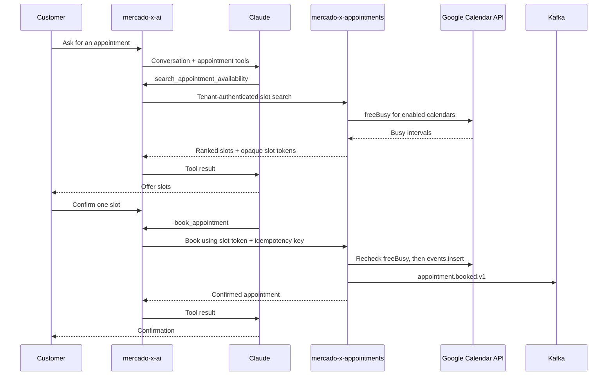

# mercado-x-appointments — V1 Shipping Plan

Status: proposed  
First integration: Google Calendar  
Consumers: `mercado-x-ai` now; MercadoX admin UI and other channels later

Legend: `[ ]` pending · `[x]` done · **P0** launch blocker · **P1** pilot blocker

---

## 1. Goal and service boundary

Ship a tenant-isolated appointment service that can connect a clinic's selected Google
calendars, calculate bookable slots, and create appointments. `mercado-x-ai` may ask this
service for availability or request a booking, but it must not call Google Calendar, store
Google credentials, or implement scheduling rules itself.

### V1 credential model

Use a clinic-owned Google Workspace scheduling user, such as
`appointments@clinic.example`, as the default V1 connection:

1. The clinic shares only the selected doctors' calendars with that scheduling user and
   grants the access needed to read availability and create events.
2. A tenant administrator connects that scheduling user to MercadoX through Google OAuth
   with offline access once.
3. MercadoX stores the refresh credential securely and refreshes short-lived access tokens
   without asking the administrator to sign in throughout the day.
4. MercadoX maintains its own tenant-scoped allowlist of calendars that may be queried or
   modified.

Terminology matters: the scheduling user above is a normal Google Workspace user. A Google
Cloud **service account with domain-wide delegation** can impersonate doctors across a
Workspace domain, but requires super-admin approval and creates a much larger security
boundary. Treat domain-wide delegation as **P2 enterprise work**, not the V1 default.

### V1 scope

- Connect or disconnect one Google scheduling account per MercadoX organization.
- Discover calendars visible to the connected account and enable a selected subset.
- Map each enabled calendar to a doctor/provider.
- Configure appointment duration, business hours, timezone, buffers, minimum notice, and
  booking horizon.
- Search availability across enabled providers.
- Book one confirmed slot and write the corresponding Google Calendar event.
- Return safe, structured results to `mercado-x-ai` and publish a durable booking event.

### Explicitly out of scope for V1

- Cancellation and rescheduling tools.
- Recurring appointments, waitlists, payments, insurance, or patient charts.
- Google Appointment Schedules product management.
- Google push notifications or a full local mirror of Google events.
- Domain-wide delegation, cross-domain impersonation, or arbitrary calendar access.
- Non-Google providers such as Microsoft 365, Calendly, or proprietary clinic systems.

---

## 2. Milestone 0 — Freeze contracts and ownership

- [ ] **P0 — ADR: confirm the V1 Google credential model.** Record the scheduling-user OAuth
  choice, required calendar sharing steps, minimal scopes, revocation behavior, and the
  reason domain-wide delegation is deferred.
- [ ] **P0 — ADR: define the synchronous versus asynchronous boundary.** Use authenticated
  HTTP for slot search and booking because Claude needs the result within the current turn;
  use Kafka only for durable events after state changes.
- [ ] **P0 — Define the tenant rule.** `orgId` must come from verified MercadoX identity and
  service-to-service authentication. It must never come from Claude tool input or a caller's
  unverified request body.
- [ ] **P0 — Define provider identity.** Decide whether V1 providers reference an existing
  MercadoX user UUID or use an appointments-owned provider record with an optional external
  reference. Do not couple scheduling logic to the existing `core.appointment` entity.
- [ ] **P0 — Publish an OpenAPI contract** for:

    - `POST /internal/v1/appointment-slots/search`
    - `POST /internal/v1/appointments`
    - tenant-admin connection, calendar-selection, provider, and policy endpoints

- [ ] **P0 — Freeze a safe error vocabulary:** `NO_SLOTS`, `SLOT_EXPIRED`, `CONFLICT`,
  `REAUTH_REQUIRED`, `NOT_CONFIGURED`, `RATE_LIMITED`, and `TEMPORARY_UNAVAILABLE`.
  Provider payloads, tokens, and stack traces must never cross into Claude tool results.
- [ ] **P1 — Audit the existing `core.appointment` table/entity.** If unused, deprecate and
  remove it in a separate migration after the new service ships. If data exists, write an
  explicit migration plan; do not silently reuse or delete it.

**Exit gate:** service ownership, auth assumptions, HTTP schemas, and the V1/non-V1 line are
reviewed before implementation begins.

---

## 3. Milestone 1 — Bootstrap the microservice

- [x] **P0 — Create the `mercado-x-appointments` repository** as a Java 17 Spring Boot service
  using the Spring Boot version and MercadoX package/build conventions established by
  `mercado-x-parent` and `mercado-x-email`.
- [x] **P0 — Add only the required foundations:** Web MVC/WebClient, validation, security,
  JPA/PostgreSQL, Flyway, Redis, Kafka/Avro, Actuator, and test dependencies.
- [ ] **P0 — Give the bounded context its own `appointments` database schema** and migration
  ownership. It may initially use the existing PostgreSQL cluster, but appointment tables
  and migrations belong to this service.
- [ ] **P0 — Keep appointment JPA entities, repositories, and Flyway locations in this
  service.** Reuse `mercado-x-context` and shared wire contracts where appropriate, but do
  not add the new scheduling model to `mercado-x-core` or extend the old shared
  `core.appointment` entity.
- [ ] **P0 — Add configuration properties** for Google OAuth, internal-client auth, Google API
  timeouts, slot-token TTL, Redis locks, availability-cache TTL, and booking limits.
- [ ] **P0 — Add health/readiness checks** for PostgreSQL and Redis. Google should be reported
  as an external dependency without making every local health probe call Google.
- [ ] **P1 — Add the service to local development orchestration** with a non-conflicting port,
  environment-variable placeholders, and no checked-in secrets.
- [ ] **P1 — Add CI gates:** compile, unit tests, integration tests, Flyway validation,
  dependency/security scan, and container build.

**Exit gate:** an empty service starts locally, authenticates a tenant request, validates its
schema, and exposes health endpoints.

---

## 4. Milestone 2 — Tenant-owned data model

- [ ] **P0 — Create `GoogleCalendarConnection`:** `id`, `org_id`, Google subject/email,
  encrypted refresh-token reference/ciphertext, granted scopes, status
  (`ACTIVE`, `REAUTH_REQUIRED`, `REVOKED`), last successful refresh, and audit timestamps.
- [ ] **P0 — Create `AppointmentProvider`:** tenant-owned doctor/provider identity, display
  name, timezone, active flag, and optional reference to an existing MercadoX user.
- [ ] **P0 — Create `ProviderCalendar`:** connection, provider, opaque Google `calendar_id`,
  display name, access role, calendar timezone, enabled flag, and last validation time.
- [ ] **P0 — Create `AppointmentType` and `AvailabilityPolicy`:** duration, weekly working
  hours, buffers, minimum notice, booking horizon, timezone, and allowed providers.
- [ ] **P0 — Create `AppointmentBooking`:** org, provider, appointment type, customer and
  conversation references, start/end instants, timezone, status, Google event ID,
  MercadoX booking ID, idempotency key, and audit timestamps.
- [ ] **P0 — Enforce tenant keys and uniqueness in PostgreSQL,** including unique
  `(org_id, idempotency_key)` and `(org_id, google_event_id)` constraints.
- [ ] **P0 — Keep provider/calendar IDs out of model-controlled authority.** Every repository
  query must constrain by the trusted `orgId`, even when IDs are globally unique UUIDs.
- [ ] **P1 — Add redacted audit records** for connection changes, calendar enablement,
  availability requests, booking attempts, conflicts, and successful bookings.

**Exit gate:** cross-tenant repository tests prove that an organization cannot read or mutate
another organization's connection, calendars, policies, or bookings.

---

## 5. Milestone 3 — Google connection and calendar onboarding

- [ ] **P0 — Configure the Google Cloud project** with Calendar API enabled, production OAuth
  consent configuration, approved HTTPS redirect URIs, privacy/terms links, and the minimal
  read-availability plus event-write scopes.
- [ ] **P0 — Implement `POST /api/v1/google-calendar/connections/start`.** Generate a signed,
  short-lived OAuth `state` bound to `orgId`, administrator identity, nonce, and return URL;
  request offline access.
- [ ] **P0 — Implement the OAuth callback.** Verify state and one-time nonce before exchanging
  the authorization code. The callback may be public, but it is authenticated by the state
  transaction and must not accept tenant identity from query parameters.
- [ ] **P0 — Protect refresh credentials before persistence.** Use envelope encryption with a
  KMS-managed key or store a secrets-manager reference. Never store raw refresh/access tokens
  in PostgreSQL, browser storage, logs, Kafka, metrics, or Claude history.
- [ ] **P0 — Implement a tenant-aware Google credential provider** that refreshes access
  tokens automatically, coalesces concurrent refreshes for one connection, and changes the
  connection to `REAUTH_REQUIRED` on terminal refresh errors.
- [ ] **P0 — Implement connection status and disconnect endpoints.** Disconnect must revoke
  the Google grant when possible, erase the stored credential, clear caches, disable mapped
  calendars, and preserve booking audit history.
- [ ] **P0 — List visible calendars with `calendarList.list`** and return only fields needed by
  the admin UI. Do not expose refresh/access tokens or raw provider error bodies.
- [ ] **P0 — Implement calendar selection and provider mapping.** Revalidate that the connected
  account can read free/busy and create events before enabling a calendar.
- [ ] **P1 — Add a connection diagnostics endpoint** that performs a bounded permission check
  and explains whether reauthorization or Google calendar sharing is required.
- [ ] **P1 — Complete Google's production publishing/verification requirements** before the
  first real tenant; OAuth apps left in Testing are not a production credential strategy.

**Exit gate:** a tenant administrator authorizes once, selects two doctor calendars, and the
backend continues operating after access-token expiry without another interactive sign-in.

---

## 6. Milestone 4 — Availability engine

- [ ] **P0 — Implement policy validation and normalization.** Store instants in UTC, preserve
  the clinic/provider timezone, and reject invalid horizons, durations, overlaps, or missing
  provider mappings.
- [ ] **P0 — Implement a Google `freeBusy` adapter** that batches enabled calendar IDs,
  applies strict timeouts, and maps Google failures into the internal error vocabulary.
- [ ] **P0 — Calculate slots server-side:** expand working windows, subtract busy intervals,
  merge overlaps, apply duration/buffers/minimum notice/horizon, and handle daylight-saving
  transitions explicitly.
- [ ] **P0 — Rank and cap results** so the AI receives a small deterministic set (for example,
  the earliest 3–5 slots), not an entire day's raw calendar contents.
- [ ] **P0 — Return opaque, tenant-bound slot tokens** containing or referencing provider,
  calendar, start/end, appointment type, and expiration. The client and Claude must not be
  allowed to replace those fields during booking.
- [ ] **P1 — Add a very short availability cache and request coalescing** keyed by tenant,
  selected calendars, policy, and window. Start around 15–30 seconds, invalidate after a
  booking/configuration change, and measure before tuning.
- [ ] **P1 — Enforce per-tenant request limits** and batch Google calls rather than issuing one
  request per doctor. Reject excessive date windows before contacting Google.
- [ ] **P0 — Implement `POST /internal/v1/appointment-slots/search`** with service identity,
  tenant context, validation, bounded response size, and stable error responses.

**Exit gate:** deterministic tests cover empty days, partial conflicts, buffers, multiple
providers, midnight boundaries, DST changes, Google 429/5xx responses, and expired grants.

---

## 7. Milestone 5 — Conflict-safe booking

- [ ] **P0 — Implement `POST /internal/v1/appointments`.** Accept an opaque slot token and a
  caller idempotency key; derive tenant and customer/conversation identity from trusted
  execution context rather than model-authored fields.
- [ ] **P0 — Acquire a short Redis lock** scoped to tenant, provider/calendar, and time range.
  The lock protects concurrent MercadoX booking attempts; document that it cannot stop a
  human from changing Google Calendar at the same instant.
- [ ] **P0 — Revalidate the slot token and call `freeBusy` again under the lock** immediately
  before creating the event. Return `CONFLICT` with a prompt to search again when occupied.
- [ ] **P0 — Create the Google event with a MercadoX-generated stable event ID** and private
  extended properties containing non-sensitive booking correlation IDs. Do not put internal
  tokens, tenant secrets, or unnecessary patient data in event metadata.
- [ ] **P0 — Persist the booking with database uniqueness constraints** and return the same
  result for repeated idempotency keys. One customer confirmation must create at most one
  Google event and one MercadoX booking.
- [ ] **P0 — Define recovery for partial failure.** If Google succeeds but local persistence
  fails, reconcile by stable Google event/correlation ID instead of blindly creating again.
- [ ] **P1 — Publish `appointment.booked.v1` after durable state change** using an outbox or an
  equivalently reliable after-commit mechanism. Add the Avro schema and topic constant to the
  shared contract library following current MercadoX conventions.
- [ ] **P1 — Invalidate affected availability cache entries** and release the lock in a
  `finally` path.

**Exit gate:** a race test sends concurrent requests for the same slot and produces exactly
one confirmed booking; retries return the original booking without duplicating the event.

---

## 8. Milestone 6 — Integrate with `mercado-x-ai`

- [ ] **P0 — Replace the current executor signature.** Introduce a trusted
  `ToolExecutionContext` carrying `orgId`, conversation ID, external customer identity,
  channel message ID, and Anthropic tool-use ID. Pass it from `ConversationAiServiceImpl`;
  never ask Claude to supply these values.
- [ ] **P0 — Replace the stub with a registry/dispatcher** that validates a tool name against
  an allowlist and deserializes each tool into a typed request. Unknown tools and invalid
  inputs return safe structured errors.
- [ ] **P0 — Register two Claude tools** on every eligible Messages API request:

    - `search_appointment_availability`: appointment type, desired date/window, customer
      timezone, and optional provider preference.
    - `book_appointment`: opaque slot token plus an explicit-confirmation signal; customer and
      tenant identity come from `ToolExecutionContext`.

- [ ] **P0 — Add an appointments WebClient** with a timeout shorter than the existing AI
  tool-loop budget, service-to-service authentication, correlation IDs, and tenant headers
  produced only from trusted context.
- [ ] **P0 — Map appointment errors into model-safe tool results** so Claude can ask for new
  dates on `NO_SLOTS`/`CONFLICT`, request administrator help on `REAUTH_REQUIRED`, and avoid
  promising a booking on ambiguous failures.
- [ ] **P0 — Add a confirmation policy to the system prompt/tool contract.** Availability may
  be searched conversationally, but `book_appointment` can run only after the customer has
  explicitly selected and confirmed a returned slot.
- [ ] **P0 — Preserve the current loop controls** and add per-tool timeouts, maximum tool
  calls per turn, response-size limits, and redacted logging. Never log full customer payloads
  or Google credentials.
- [ ] **P1 — Persist tool audit metadata** (tool name, correlation ID, success/error code,
  latency) without copying secrets or full Google responses into conversation history.
- [ ] **P1 — Update the AI architecture documentation and README** so the first tool path
  points to `mercado-x-appointments`; keep later commerce/CRM tools as separate adapters
  rather than routing appointment work through `mercado-x-core`.
- [ ] **P0 — Remove `ToolExecutorServiceStub` only after** the real dispatcher is wired and
  tests prove both no-tool and tool-use conversations still work.

**Exit gate:** the current WhatsApp flow can search, offer, confirm, book, and publish its
normal `ai.reply.generated.v1` response without either Claude or `mercado-x-ai` receiving a
Google credential.

---

## 9. Milestone 7 — Security, resilience, and observability

- [ ] **P0 — Implement service-to-service authorization.** Use a short-lived machine token
  whose subject identifies `mercado-x-ai`, whose audience is
  `mercado-x-appointments`, and whose scopes distinguish availability from booking.
- [ ] **P0 — Add machine-token issuance and shared claim support.** Extend
  `mercado-x-oauth` (or the selected workload-identity provider) to issue service tokens and
  extend `mercado-x-context`'s verified JWT model to carry audience/scopes. The current
  issuer-only user-token verifier is not sufficient for this boundary.
- [ ] **P0 — Validate issuer, signature, expiration, audience, subject, scopes, and tenant** at
  the appointments boundary. Add negative tests for tenant/header/token mismatches.
- [ ] **P0 — Set strict connect/read/overall deadlines.** Retry only safe transient Google
  failures with bounded exponential backoff and jitter; respect rate-limit guidance and do
  not automatically replay a non-idempotent booking without its idempotency key.
- [ ] **P1 — Add circuit breaking and bulkheads** so one tenant's Google outage or quota usage
  cannot exhaust all request threads or block other tenants.
- [ ] **P0 — Add metrics:** Google latency/error/rate-limit counts, token-refresh failures,
  connection status, slot searches and outcomes, booking conflicts, booking latency,
  idempotency hits, lock contention, and event-publication lag.
- [ ] **P0 — Add structured tracing** across WhatsApp event → AI turn → tool call → appointment
  request → Google request → booking event, using correlation IDs rather than PII.
- [ ] **P0 — Alert on** rising `REAUTH_REQUIRED` counts, sustained Google failures, booking
  reconciliation failures, outbox backlog, and abnormal conflict/duplicate rates.
- [ ] **P1 — Document credential rotation, Google revocation, tenant offboarding, audit export,
  incident response, and least-privilege review procedures.

---

## 10. Milestone 8 — Test and pilot

- [ ] **P0 — Unit tests:** policy validation, interval subtraction, buffers, slot ranking,
  slot-token signing/expiry, tenant guards, error mapping, and idempotency behavior.
- [ ] **P0 — Google adapter contract tests:** fake OAuth/token responses, calendar discovery,
  `freeBusy`, event insertion, 401 refresh, 403 permission loss, 429 throttling, 5xx, timeout,
  and malformed responses.
- [ ] **P0 — Integration tests with Testcontainers:** PostgreSQL/Flyway, Redis locks/cache,
  Kafka/Schema Registry contract compatibility, tenant isolation, and transactional recovery.
- [ ] **P0 — `mercado-x-ai` tests:** capture Anthropic request tool definitions, mock the
  appointments API, exercise search and book tool results, enforce confirmation, and prove
  unknown/malformed tools fail safely.
- [ ] **P0 — End-to-end workflow test:** WhatsApp inbound event → mocked Claude tool use →
  appointments service → fake Google → Claude final text → `ai.reply.generated.v1`.
- [ ] **P1 — Pilot with one clinic and at least two doctor calendars.** Use a tenant feature
  flag, low request limits, dashboards, and a documented manual fallback.
- [ ] **P1 — Run failure drills:** revoke the Google grant, remove calendar permissions,
  expire a slot, race two bookings, make Google time out, restart service instances during
  token refresh, and replay the same booking request.
- [ ] **P1 — Review pilot evidence** before broader rollout: successful booking rate, search
  latency, Google quota behavior, conflict rate, reauthorization rate, and support cases.

---

## 11. Recommended implementation order

1. Approve Milestone 0 decisions and OpenAPI contracts.
2. Bootstrap the service and tenant-owned schema.
3. Complete OAuth, secure credential storage, and calendar/provider selection.
4. Ship read-only availability behind a tenant feature flag.
5. Add slot tokens, locking, recheck, idempotent booking, and booking events.
6. Wire the two Claude tools into `mercado-x-ai`.
7. Complete production security/observability and run the end-to-end test suite.
8. Enable one pilot clinic, then expand tenant by tenant.

Read-only availability is the first safe vertical slice. Booking should not be enabled until
credential protection, tenant enforcement, slot revalidation, locking, and idempotency all
pass their exit gates.

---

## 12. V1 definition of done

- [ ] A tenant administrator authorizes a clinic scheduling account once and selects only the
  calendars MercadoX may manage.
- [ ] Access-token expiration is handled automatically; interactive reauthorization is needed
  only after revocation, terminal credential failure, or policy changes.
- [ ] A customer can ask for a day or date range and receive a small set of valid local-time
  slots across the configured doctors.
- [ ] A booking happens only after explicit confirmation, is rechecked against Google, and is
  exactly-once from MercadoX's perspective under retries and races.
- [ ] Cross-tenant access, model-supplied tenant/calendar authority, plaintext credential
  storage, and raw provider-error leakage are covered by automated negative tests.
- [ ] The full WhatsApp → AI → appointments → Google → AI reply path is observable by
  correlation ID and has documented operational recovery steps.
- [ ] The first clinic completes a monitored pilot with agreed reliability and latency targets
  before general availability.

---

## Official Google implementation references

- OAuth 2.0 for web server applications and offline access:
  <https://developers.google.com/identity/protocols/oauth2/web-server>
- Calendar API authorization scopes:
  <https://developers.google.com/workspace/calendar/api/auth>
- Free/busy query:
  <https://developers.google.com/workspace/calendar/api/v3/reference/freebusy/query>
- Create calendar events:
  <https://developers.google.com/workspace/calendar/api/v3/reference/events/insert>
- Domain-wide delegation (deferred enterprise option):
  <https://developers.google.com/identity/protocols/oauth2/service-account#delegatingauthority>
